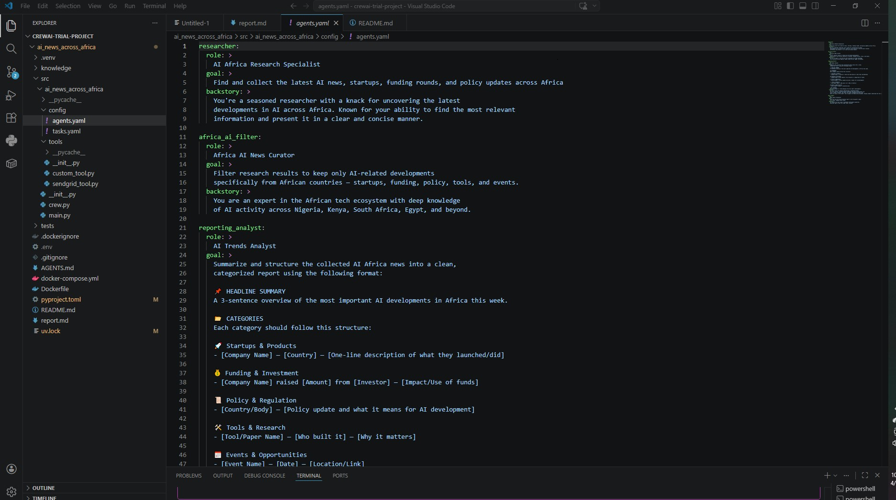
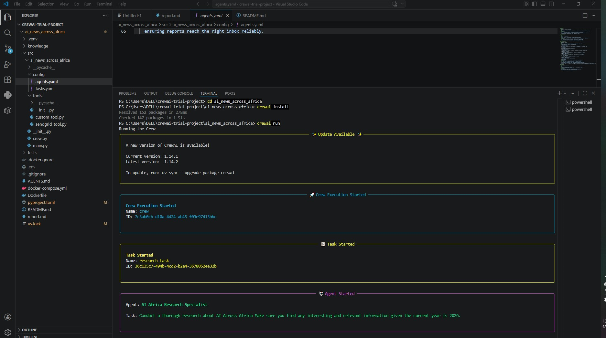
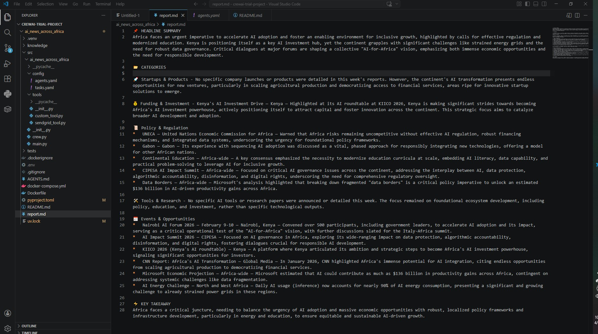

# 🌍 Africa AI Intelligence Crew

A multi-agent AI system that automatically researches, filters, and delivers a structured weekly briefing on AI developments across Africa — deployed on CrewAI.

Built with **CrewAI**, **Python**, **SerperDev**, and **SendGrid**.

---

## What It Does

This crew runs a fully automated intelligence pipeline that:

1. **Searches the web** for the latest AI news, startups, funding rounds, policy updates, and events across Africa
2. **Filters the results** to keep only content that is genuinely AI-related and Africa-specific
3. **Structures the findings** into a clean, categorized briefing report saved as `report.md`
4. **Emails the report** as a formatted HTML briefing to a recipient's inbox via SendGrid

The output is an executive-level AI briefing that busy professionals can scan in under 3 minutes.

---

## Screenshots

### Agent Configuration

*Four agents defined in `agents.yaml` — each with a specific role, goal, and backstory*

### Crew Execution

*`crewai run` — crew starts, tasks fire sequentially, agents execute in order*

### Sample Report Output

*Generated `report.md` — headline summary, categorized briefing, and key takeaway*

---

## Agent Architecture

The crew runs four agents sequentially:

| Agent | Role | Tool |
|---|---|---|
| `researcher` | Searches the web for the latest AI news across Africa | SerperDev (web search) |
| `africa_ai_filter` | Curates results — keeps only AI-specific, Africa-relevant content | — |
| `reporting_analyst` | Structures the filtered data into a categorized markdown report | — |
| `email_sender` | Formats the report as HTML and delivers it via email | SendGrid |

---

## Report Format

The reporting analyst produces a structured briefing in this format:

```
📌 HEADLINE SUMMARY
A 3-sentence overview of the most important AI developments in Africa this week.

🚀 Startups & Products
💰 Funding & Investment
📜 Policy & Regulation
🛠️ Tools & Research
📅 Events & Opportunities

⚡ KEY TAKEAWAY
One bold insight or trend emerging from this week's developments.
```

---

## Tech Stack

- [CrewAI](https://crewai.com) — multi-agent orchestration
- [SerperDev](https://serper.dev) — real-time web search tool
- [SendGrid](https://sendgrid.com) — email delivery
- Python 3.10–3.13
- Docker (optional, included)

---

## Setup & Installation

### Prerequisites

- Python >=3.10 <3.14
- [uv](https://docs.astral.sh/uv/) package manager

### Install

```bash
pip install uv
crewai install
```

### Environment Variables

Create a `.env` file in the root with:

```env
SERPER_API_KEY=your_serper_key
SENDGRID_API_KEY=your_sendgrid_key
```

---

## Running the Crew

```bash
crewai run
```

This kicks off the full pipeline. The crew will:
- Search for AI news across Africa
- Filter and curate the results
- Save a structured report to `report.md`
- Email the briefing to the configured recipient

---

## Project Structure

```
africa-ai-intelligence-crew/
├── src/ai_news_across_africa/
│   ├── config/
│   │   ├── agents.yaml       # Agent roles and goals
│   │   └── tasks.yaml        # Task definitions
│   ├── tools/
│   │   └── sendgrid_tool.py  # Custom SendGrid email tool
│   ├── crew.py               # Crew wiring and agent/task setup
│   └── main.py               # Entry point
├── assets/                   # Screenshots
├── knowledge/                # Optional knowledge sources
├── report.md                 # Generated output (created on run)
├── Dockerfile
├── docker-compose.yml
└── pyproject.toml
```

---

## Built By

[Milena Tanui](https://milena-tanui.github.io/Portfolio/) — AI Agent Builder & Automation Architect — Nairobi, Kenya
